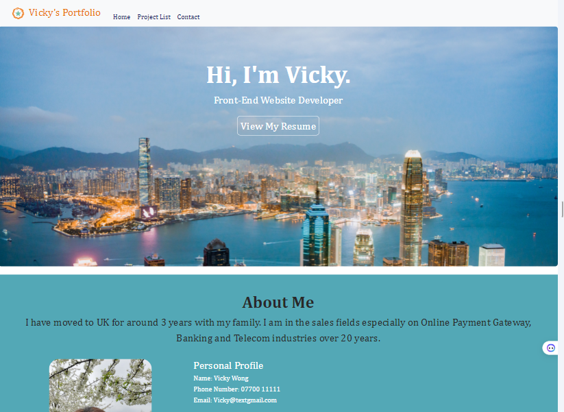
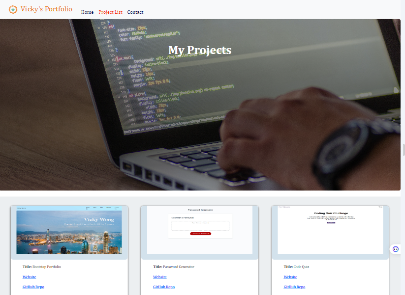
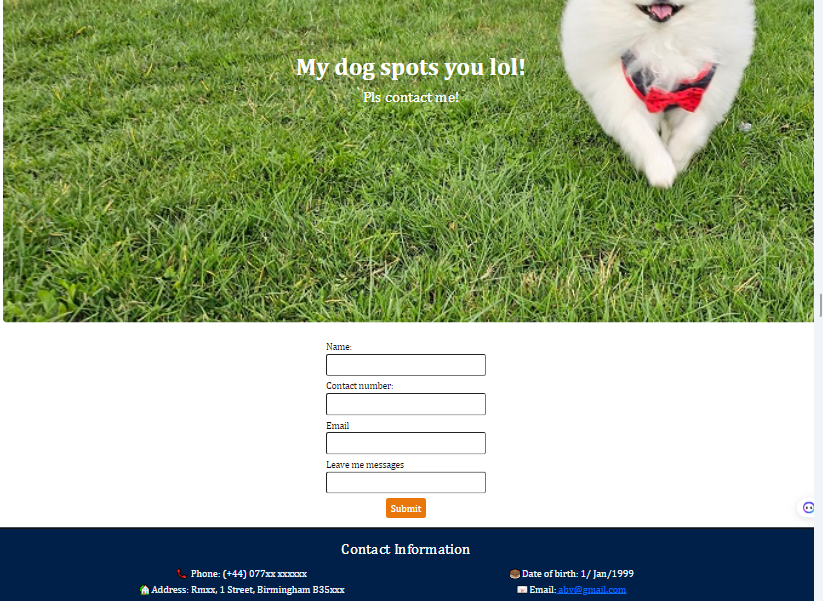

# React-Portfolio
## :clapper: ScreenTracker Overview
Track what's on your screen - movies, series and your watching library.
![Website Preview] https://vickyw0102.github.io/React-Portfolio/ 
## Table of Contents
- [Website Preview](#website-preview)
- [Features](#features)
- [Technologies Used](#echnologies-used)
- [Project Requirements](#project-requirements)
- [Usage](#usage)
- [License](#license)
- [Contact](#contact)
## Website Preview

Here's a look at the ScreenTracker web application:
Home page:

- with contact info, LinkedIn and Github link

Project page:

- including cards with project lists with website , REPO links

Project Gallery:

-click the screenshot link to redirect to the project's screenshot

Contact page:

- with contact form and contact info

## Features
- **Responsive Design**: Your data stays on your device, ensuring your privacy and security.
## Technologies Used
- HTML5
- CSS3
- React
- Json
- Bootstrap
- JavaScript

## Project Requirements
To ensure a dynamic and responsive user experience, ScreenTracker incorporates:
- Bootstrap for responsive design and components.
- Props and get data from json
- Route to different page
- Contact form 

## Usage

## License
Distributed under the MIT License. See LICENSE for more information.

## Contact